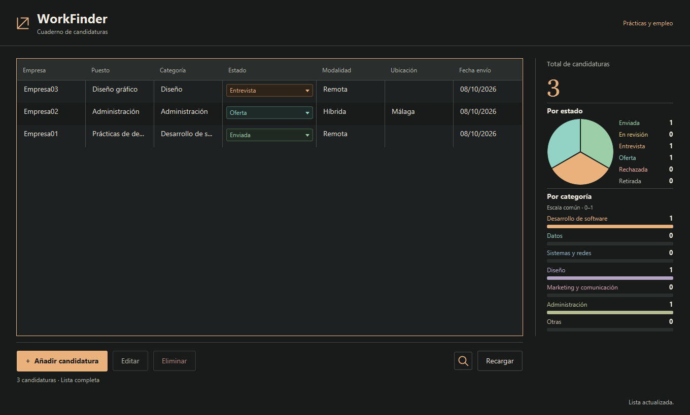
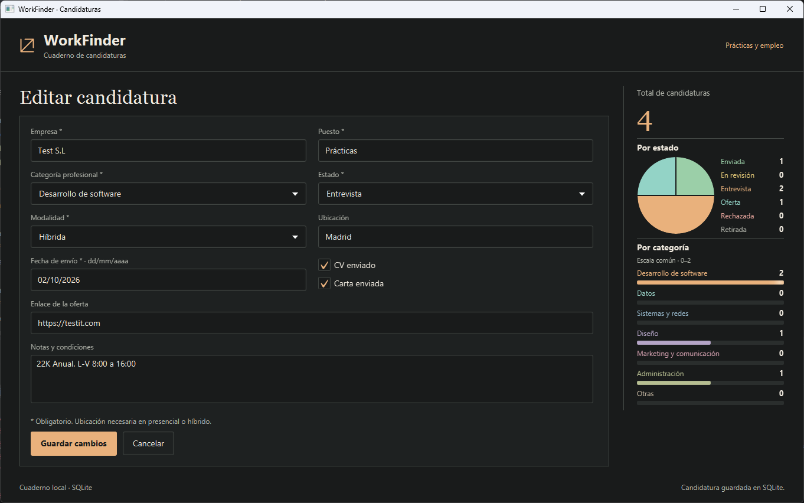
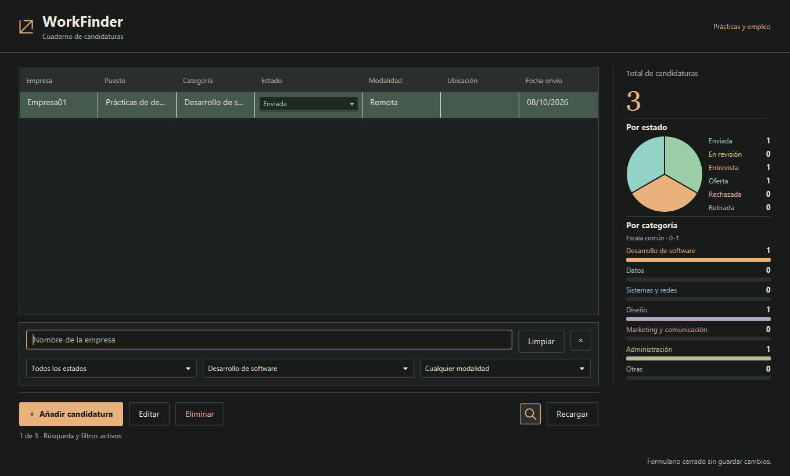

# WorkFinder

Aplicación de escritorio para organizar candidaturas a prácticas y empleo, desarrollada con **Java 17, JavaFX, Maven y SQLite**. Permite mantener en un mismo lugar las ofertas a las que te has presentado, sus condiciones y el avance de cada proceso.



## Funcionalidades

- Añadir, consultar, editar y eliminar candidaturas.
- Cambiar el estado directamente desde la tabla.
- Buscar por empresa y combinar filtros de estado, categoría profesional y modalidad.
- Consultar el total de candidaturas, su distribución por estado y las barras por categoría.
- Conservar los datos entre sesiones mediante SQLite, sin depender de un servidor externo.

Cada fila representa **una candidatura**. Puedes registrar varias para una misma empresa o puesto; cada una conserva su identificador y sus datos.

## Capturas

<details>
<summary>Formulario de edición</summary>



</details>

<details>
<summary>Búsqueda y filtros</summary>



</details>

## Cómo se usa

### Registrar y actualizar candidaturas

Pulsa **Añadir candidatura** para abrir el formulario dentro de la ventana. Registra empresa, puesto, categoría profesional, estado, modalidad, ubicación, enlace de la oferta y fecha de envío. También puedes indicar si enviaste el CV y la carta de presentación, y guardar notas o condiciones de la oferta.

Selecciona una fila para habilitar **Editar** y **Eliminar**. La edición permite consultar y modificar todos sus datos; Cancelar conserva la versión guardada. La eliminación solicita confirmación antes de borrar.

El estado también se puede cambiar desde el selector de la propia tabla: Enviada, En revisión, Entrevista, Oferta, Rechazada o Retirada. Cada selección se guarda en SQLite. Si falla, se restaura el valor anterior y se muestra un mensaje.

El formulario valida antes de guardar:

- Empresa, puesto, categoría, estado, modalidad y fecha de envío son obligatorios.
- La ubicación es obligatoria para presencial o híbrida; en remoto es opcional.
- La fecha debe ser real, tener formato `dd/mm/aaaa` y no ser posterior a hoy.
- El enlace es opcional; si se incluye, debe ser una URL completa con `http://` o `https://`.

Los campos incorrectos se marcan con una explicación. Los errores de validación o almacenamiento conservan los valores del formulario para poder corregirlos y reintentar. Durante el guardado se bloquean las acciones que podrían duplicar la operación.

### Buscar y filtrar

La **lupa**, junto a Recargar, abre el panel de búsqueda. Puedes buscar parte del nombre de una empresa sin distinguir mayúsculas ni tildes; la búsqueda no incluye el puesto ni las notas.

- Los filtros de estado, categoría y modalidad se combinan con la empresa: cada resultado debe cumplir todos los criterios activos.
- **Limpiar** restaura la lista completa. Ocultar el panel con la lupa, × o Esc conserva los criterios.
- El recuento bajo las acciones indica cuántas candidaturas coinciden con la búsqueda.
- Añadir, editar, eliminar, cambiar un estado o recargar mantiene los filtros. Si una candidatura guardada queda fuera del resultado, la aplicación lo indica o retira la fila de la tabla; sus datos siguen en la base.

Los filtros se mantienen durante la sesión, pero no al cerrar. **Recargar** permite consultar los datos de nuevo, por ejemplo después de modificarlos desde otra instancia.

### Consultar estadísticas

El panel lateral representa **todas las candidaturas**, independientemente de los filtros de la tabla. Se actualiza después de cada cambio guardado o recarga.

La gráfica circular muestra la distribución por estado; al pasar el cursor por un sector o su leyenda, puedes consultar cantidad y porcentaje. Los sectores también reciben foco con Tab. Las barras muestran cantidades por categoría y comparten una misma escala para facilitar la comparación.

Una base vacía muestra total cero. Un fallo de recarga conserva las cifras de la última carga correcta y avisa de ello; un fallo inicial indica que los datos no están disponibles.

## Atajos de teclado

| Atajo | Acción |
| --- | --- |
| Ctrl+N | Abrir una candidatura nueva. |
| Ctrl+S | Guardar el formulario abierto. |
| Ctrl+F | Abrir la búsqueda y enfocar el campo de empresa. |
| F5 | Recargar la lista y las estadísticas. |
| Esc | Ocultar la búsqueda o saltar la animación de entrada. |

Los atajos respetan el bloqueo durante las operaciones; Recargar no sustituye un formulario abierto. En macOS, los atajos Ctrl usan la tecla de acceso directo del sistema, Cmd.

## Requisitos y ejecución

Necesitas un **JDK 17** y conexión a Internet para descargar las dependencias la primera vez. El proyecto incluye Maven Wrapper; no requiere instalar Maven, el SDK de JavaFX ni un servidor de base de datos.

Desde la raíz del proyecto, en Windows:

```powershell
.\mvnw.cmd javafx:run
```

En Linux o macOS:

```sh
sh ./mvnw javafx:run
```

Para ejecutar desde un IDE, importa la carpeta como proyecto Maven, selecciona JDK 17 y recarga las dependencias. Ejecuta **`com.davidcuadralara.workfinder.Main`** como aplicación Java: es el lanzador independiente de la clase JavaFX `WorkFinderApplication`.

Para desactivar las animaciones, añade `-Dworkfinder.animations=false` a las opciones de la JVM.

## Datos locales

SQLite guarda las candidaturas en `${user.home}/.workfinder/workfinder.db` (en Windows, `%USERPROFILE%\.workfinder\workfinder.db`). La carpeta y el esquema se crean automáticamente al abrir, sin borrar los registros existentes.

La base permanece fuera del proyecto y de `target`. Para hacer una copia de seguridad, cierra WorkFinder y copia el archivo. Puedes elegir otra ubicación con la opción de JVM `-Dworkfinder.db.path=RUTA_ABSOLUTA`.

Las operaciones de base de datos se ejecutan en segundo plano para mantener la ventana disponible. Los cambios en pantalla se confirman después de guardarse; si una operación falla, se informa del error y se conserva el dato anterior.

## Estructura del proyecto

El código está en `src/main/java/com/davidcuadralara/workfinder`:

| Paquete | Responsabilidad |
| --- | --- |
| `model` | Candidatura, enumeraciones, filtros y resumen, independientes de JavaFX. |
| `service` | Validación, operaciones, búsqueda y cálculo de estadísticas. |
| `repository` | Creación del esquema y persistencia SQLite mediante JDBC. |
| `ui` | Vistas JavaFX, formularios, gráficas y gestión de eventos. |

La interfaz llama al servicio y este al repositorio, con dependencias recibidas por constructor. El CSS está en `src/main/resources/com/davidcuadralara/workfinder/css/workfinder.css`.

## Pruebas

Para compilar, ejecutar las pruebas y generar el JAR:

```powershell
.\mvnw.cmd verify
```

En Linux o macOS, usa `sh ./mvnw verify`. Las pruebas cubren validación, filtros, estadísticas y persistencia con bases temporales, sin modificar la base personal.

El JAR se genera en `target`; no incluye un instalador ni JavaFX autónomo. Para abrir la aplicación con sus dependencias, utiliza `javafx:run`.
